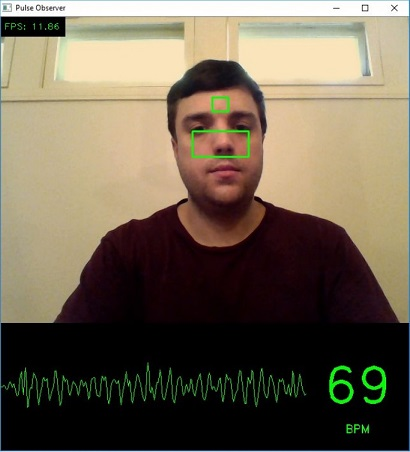

# Pulse Observer

## Description

Compute a person's pulse via webcam in real-time by tracking tiny changes in face coloration due to blood flow. For best results, try to minimize movement.

Uses Python, OpenCV, NumPy, SciPy, and Dlib.

## Requirements

-   Python 2.7.x
-   OpenCV 3.0
-   NumPy 1.11
-   SciPy 0.17.1
-   Dlib 18.17.100
-   Download [Dlib's pre-trained predictor model for facial landmarks](http://sourceforge.net/projects/dclib/files/dlib/v18.10/shape_predictor_68_face_landmarks.dat.bz2) and put it in the same directory as _pulse_observer.py_.

## Compatibility

-   This program has **only** been tested on Windows 10. It may or may not work on Linux or Mac OS.
-   It will only work with Python 2.7.x. It will **not** work with Python 3+.
-   Tested with the following webcams:
    -   Logitech C270
    -   Logitech C920
    -   Asus laptop

## Author

Kevin Perry
(kevinperry@gatech.edu)
